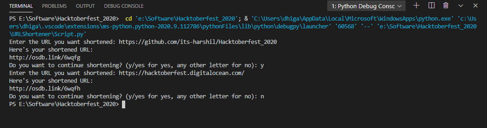

# URL Shortener

This is a simple Python Script to automate shortening of URLs. Uses the `pyshorteners` library to shorten URLs.

## Requirements

Install `pyshorteners` by running the following command with pip: `pip install pyshorteners`.

## Usage

Simply run this file in terminal by running the command: `python Script.py`. You will then be required to enter the URL you want shortened.  
Note: Once you enter the shortened link, you will be required to wait for 5-10 seconds depending on the osdb site. Once you skip the advertisement, you will be redirected to the original URL.

## Screenshots displaying Output

## Author

This script was created by [Dhiganth Rao](https://github.com/dhiganthrao) for [Hacktoberfest 2020.](https://hacktoberfest.digitalocean.com/)
